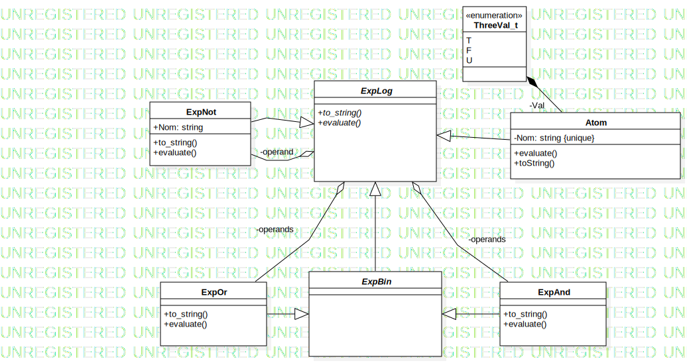

# TP2 : Logique ternaire

Le TP2 correspondant à l'UE *CM LANGAGE OBJET C++-UML* a pour but d'étudier la mise en place d'un système de logique ternaire. Celui-ci est très proche du système binaire, avec le simple ajoute d'une valeur ternaire : `U` pour Unknown. L'ajout de cette valeur autorise la création de nouvelles équations logique et surtout la manipulations de celles-ci. L'objectif final du TP et de pouvoir résoudre une équation logique sous *F*orme *N*ormale *C*onjonctive. Il a aussi pour vocation d'étudier le polymorphisme en programmation objet.

## 1. Introduction 

En *C++*, un façon de définit trois valeur ternaire est de les emboiter dans une énumération comme suit :

```C++
enum ThreeVal_t {T='T',F='F',U='U'};
```
Des charactères sont donnés comme valeurs, afin que l'affichage des instance soit plus simple.
Cet énumération permet l'utilisation des valeurs ternaires.

## 2. Présentation du diagramme de classe lié au problème 

Le sujet nous invite à créer 6 classes, les **Atom**, les **Exp**(ressions)**Log**(iques), les **Exp**(ressions)**Bin**(aires), les **Exp**(ressions)**And**, les **Exp**(ressions)**Not**, les **Exp**(ressions)**Or**. Ces différentes classes nous permettrons de manipuler et créer des **FNC**. Le diagramme suivant présente les relations qui existent entre ces classes.



## 3. La fonction `create`

L'ensemble des fonctions implémentées permettent de l'écriture d'une fonction `create` qui doit selon le sujet :

> construire une expression logique `a partir d’un fichier au format DIMACS

Ce format assez particulier instaure des règles d'écriture pour définir un **FNC**. 
La fonction `create` permet de lire un fichier tout en créant l'expression logique correspondant à la **FNC** associée.
Cette fonction repose sur l'utilisation de pointeurs et un principe de récurcivité. 

Pseudo-fonctionnement de `create` :

1. Lecture du fichier, en ignorant toutes les lignes commencant par un *'c'*

2. Lorsque la ligne décrivant le nombre de variables et de clause est atteinte, entrer dans la boucle de création de l'expression finale.

3. Pour chaque ligne : 
Pour chaque nombre rencontré, si il existe déjà une expression logique associé à ce nombre, on crée un **OU** logique entre l'expressionassocié au nombre et celle lue précédemment.
Mais si le nombre n'est associé à aucune expression, on crée un nouvel `Atom` et on un **OU** entre le nouvel atom et celui lu précemment..
Enfin, au passage a une nouvelle ligne, on effectue un **ET** entre la ligne précédente, et celle qui vient d'être lue.

## 4. Résoudre une CNF

La résolution d'un **CNF** de manière brut peut se faire en testant toutes les combinaison possible de valeurs binaires pour toutes la variables de la CNF. Cependant, cela est très couteux. On peut éliminer toutes les combinaisons qui donnent une des expression du **AND** fausse. Ainsi on peut procéder pour chaques Expression Logique surlesquelles on effectue un **AND**, et garder uniquement les combinaison qui donne `T` pour l'expression. Ensuite on n'a plus qu'a tester ces combinaision sur les autres expression (celles sur lesquelles on applique le **AND**) et le nombre de combinaisons réalisable diminuera à chaque nouveau **AND** rencontré.

## 5. Utilisation des tests

Afin de vérifier si les fonctionnalité fondamentale du TP on été implémentée, un fichier `testcase` a été écrit. Pour le compiler il suffit de lancer les commande : 
```bash
make testcase
./testcase
```